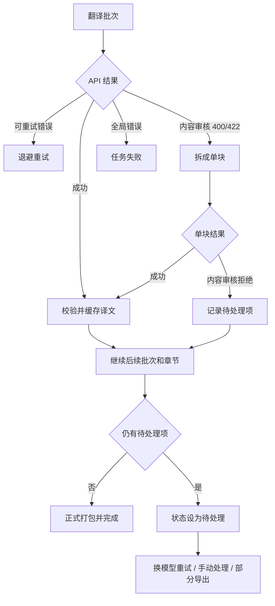

# 翻译待处理状态与失败块恢复设计

## 背景

整书翻译可能因为单个内容块被第三方 API 的内容审核拒绝而中断。真实案例中，`api.edgefn.net` 对《Communion》Chapter 8 的一段教会性侵受害者证词返回 HTTP 400：

```text
InvalidRequestBody
The request failed because the input may contain sensitive information.
```

同一章节的相邻批次可以正常返回 HTTP 200。现有实现会让整个任务立即失败，并丢失服务端错误体，只向用户展示 Dio 的通用 400 说明。已经完成的块仍保存在缓存中，但用户无法在当前任务中查看、重试或手动处理被拒绝的块。

## 目标

- 服务商拒绝一个批次时，自动拆分到单块，保存其中成功的译文。
- 将被内容审核拒绝的单块记录为「待处理项」，继续翻译其余章节。
- 所有可翻译内容处理完成后，将任务标记为「待处理」，不能静默标记为成功。
- 默认不生成正式 EPUB，避免用户误以为译本完整。
- 支持使用当前或其他模型仅重试待处理块，不重新翻译已经成功的块。
- 支持用户手动填写待处理块译文。
- 用户明确确认后，可以导出包含未处理原文的部分完成版 EPUB。
- 向用户展示经过脱敏的服务端真实拒绝原因，不记录 API Key 或完整请求体。

## 非目标

- 不绕过、规避或对抗服务商的内容审核策略。
- 不自动改写、拆字或混淆原文来逃避审核。
- 不在用户不知情时切换 API、模型或服务商。
- 不把含有未处理块的 EPUB 标记为完整译本。
- 不在任务历史中存储 API Key、完整 API 请求或完整服务端响应。

## 术语

- **待处理项（Translation Issue）：** 一个未获得合格译文的原始 EPUB 块。
- **待处理任务（Needs Attention）：** 其他可翻译内容已经完成，但仍有待处理项的任务。
- **部分完成版（Partial EPUB）：** 用户明确确认后导出的 EPUB，其中待处理块保留原文。
- **恢复清单（Recovery Manifest）：** 保存任务成功块引用、待处理项和人工解决结果的持久化记录。

## 状态模型

在 `TranslationJobStatus` 中增加 `needsAttention`。状态语义如下：

| 状态 | 含义 | 可正式导出 |
|---|---|---|
| `running` | 正在翻译 | 否 |
| `failed` | 全局错误导致任务无法继续，例如认证失败或请求格式整体错误 | 否 |
| `needsAttention` | 可翻译内容已完成，但存在待处理块 | 否 |
| `completed` | 所有选中块都有合格译文，EPUB 已生成 | 是 |

`needsAttention` 不是 `failed` 的别名。它表示整书扫描与其他块翻译已经完成，用户只需处理有限的问题块。

## 待处理项数据结构

新增 `TranslationBlockIssue`，至少包含：

```text
issueId              稳定 ID，由恢复清单、章节路径、块 ID 和原文哈希生成
chapterPath          XHTML 路径
chapterTitle         用户可识别的章节标题
blockId              EPUB 提取块 ID
sourceHash           原始 HTML 哈希，用于检测原书是否变化
sourcePreview        最多 160 个字符的脱敏原文预览
kind                 contentRejected / invalidRequest / qualityRejected
httpStatus           HTTP 状态码，可为空
providerCode         服务端错误码，例如 InvalidRequestBody
safeReason           脱敏后的简短原因
requestId            服务端请求 ID，可为空
attempts             已尝试次数
resolution           unresolved / apiTranslated / manuallyTranslated / keepSource
resolvedHtml         仅在已解决时保存，并沿用现有 HTML 结构校验
createdAt            首次发现时间
updatedAt            最近处理时间
```

历史记录只保存预览和脱敏原因。完整原文从用户的原始 EPUB 中按 `chapterPath + blockId + sourceHash` 重新定位。

## API 错误分类

`TranslationApiClient` 负责从 Dio 响应中提取结构化错误，生成 `ProviderErrorDetails`：

- HTTP 状态码；
- 服务端 `code`、`reason`、`message`；
- `metadata.reason` 与 `request_id`；
- 是否属于内容审核拒绝；
- 是否可重试；
- 经过 `SensitiveText.redact` 处理的用户提示。

分类规则：

- `401 / 403`：认证或权限错误，立即终止任务。
- `408 / 429 / 5xx`：按照现有退避策略重试。
- `400 / 422` 且错误原因明确包含敏感内容或内容审核：批次不再重复相同请求，进入单块拆分。
- 其他 `400 / 422`：视为全局请求错误，保留失败语义，不能静默跳过。
- `413`：沿用现有批次拆分逻辑。

## 批次拆分与继续翻译

翻译批次返回内容审核拒绝时：

1. 将批次拆成独立块请求，不重复发送原批次 4 次。
2. 每个单块独立产生成功或待处理结果。
3. 成功译文立即写入常规块缓存和恢复清单。
4. 再次被内容审核拒绝的单块写入待处理项，保留原块，不写入译文缓存。
5. 当前章节继续处理后续批次；其他章节继续翻译。
6. 网络、认证、限流、模型不存在等全局错误仍按现有规则中止任务。

并发窗口不能继续使用失败即整体抛出的 `Future.wait` 结果。每个批次返回 `TranslationBatchOutcome`，其中分别包含成功译文和待处理项。只有全局错误才向上抛出。

## 缓存与跨模型恢复

当前块缓存键包含 API 地址和模型名称。直接切换模型会导致旧成功块无法命中，因此新增恢复清单：

- 恢复清单使用不包含 API 地址、模型名称和 API Key 的稳定 `recoveryKey`。
- `recoveryKey` 包含输入 EPUB 指纹、目标语言、双语模式、术语表、残留检查开关、确认后的风格档案和选中章节。
- 每个成功块记录原常规缓存键、章节路径、块 ID 和原文哈希。
- 使用其他模型重试待处理项时，只请求待处理块。
- 最终打包时，普通块从原常规缓存读取，已解决问题块从恢复清单读取。
- 升级后首次续传旧任务时，已有常规缓存命中会被登记进恢复清单，不会重新调用 API。

更换目标语言、术语表、双语模式或确认后的风格档案会创建新的恢复任务，因为这些变化会实质改变译文。

## 手动处理

待处理详情页展示：

- 章节标题与块编号；
- 原文预览；
- 服务端拒绝原因；
- 原始 HTML 结构的只读摘要；
- 人工译文输入框。

人工译文默认按纯文本输入。保存时通过现有 HTML 结构锁定逻辑放回原标签，并再次执行：

- 空译文检查；
- HTML 结构校验；
- 源语言残留检查。

校验失败时不能保存。成功后将问题标记为 `manuallyTranslated`。

## 输出策略

### 正式输出

只有待处理项为 0 时才执行现有正式 EPUB 打包，并将任务状态设为 `completed`。

### 部分完成版

`needsAttention` 状态提供「导出部分完成版」操作。用户必须在确认对话框中知晓：

- 仍有多少未处理块；
- 未处理块会保留原文；
- 输出不是完整译本。

文件名使用 `_translated_partial.epub`，不会覆盖正式输出或原始 EPUB。任务状态保持 `needsAttention`。

## 用户界面

进度卡在翻译结束后显示：

```text
待处理
已翻译 1642 / 1643 块 · 1 个块需要处理
```

提供 3 个操作：

- 「重试待处理块」：使用当前设置，只请求问题块；允许用户先切换模型。
- 「手动处理」：进入待处理项列表并填写译文。
- 「导出部分完成版」：经过确认后生成 `_translated_partial.epub`。

任务历史显示 `needsAttention` 徽标和待处理数量。重新启动软件后仍能恢复问题列表和已完成块引用。

## 数据流



## 安全与隐私

- API Key 继续使用 DPAPI 或平台安全存储，不写入恢复清单。
- 错误信息必须经过 `SensitiveText.redact`。
- 不记录完整请求体、完整服务端响应或整段敏感原文。
- 原文预览限制为 160 个字符，并压缩空白字符。
- `request_id` 可以保存，用于联系服务商排查，但不能包含鉴权信息。

## 测试范围

### 单元测试

- 解析并脱敏 edgefn 的 `InvalidRequestBody` 错误体。
- 内容审核 400/422 被识别为不可重复批量重试、可单块拆分。
- 认证错误、普通 400、429 和 5xx 保持正确语义。
- 单块成功译文与待处理项可以同时出现在 `TranslationBatchOutcome`。
- `TranslationBlockIssue` 与 `needsAttention` 能序列化、恢复旧历史并向后兼容。
- 切换模型后只重试待处理块，已成功块不重新请求。
- 人工译文必须通过 HTML、空文本和残留检查。
- 有待处理项时禁止正式输出，部分完成版使用独立文件名。

### 控制器与界面测试

- 翻译结束后显示待处理状态、数量和 3 个操作。
- 重启后恢复待处理项。
- 明确确认后才能导出部分完成版。
- 处理最后一个问题块后自动进入正式打包流程。

### 真实 EPUB 验收

- 使用《Communion》Chapter 8 第 19 批复现内容审核拒绝。
- 验证相邻第 20 批仍能翻译并缓存。
- 验证任务继续至全书末尾，并只留下被拒绝的单块。
- 验证使用另一模型或手动译文解决后生成完整 EPUB。
- 验证旧任务已完成的 998 块在升级后可以复用。

## 验收标准

- 单个内容审核拒绝不能中止整书其他块的翻译。
- 成功块不会因为同一并发窗口中的另一个块失败而丢失。
- 确定性的内容审核 400 不会重复请求 4 次。
- 用户能看到章节、块编号、预览和脱敏拒绝原因。
- 未处理块存在时，任务不能显示为成功，也不能默认生成正式 EPUB。
- 用户可以更换模型仅重试待处理块，或手动提供译文。
- 部分完成版必须经过明确确认，并使用不同文件名。
- 现有旧缓存能够迁移进恢复清单，不重新消耗已经完成块的 API 费用。
